# Plateforme E-commerce Laravel

Une plateforme e-commerce moderne construite avec Laravel, proposant un design responsive, une authentification utilisateur, une gestion des produits, un panier d'achat et un traitement des commandes.

## 📸 Captures d'écran

### Interface Client

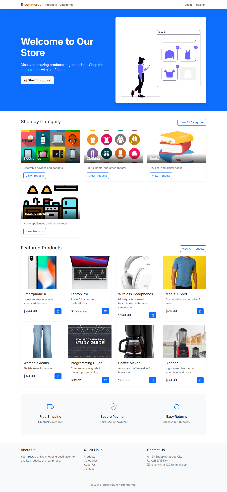
*Page d'accueil avec produits et catégories en vedette*

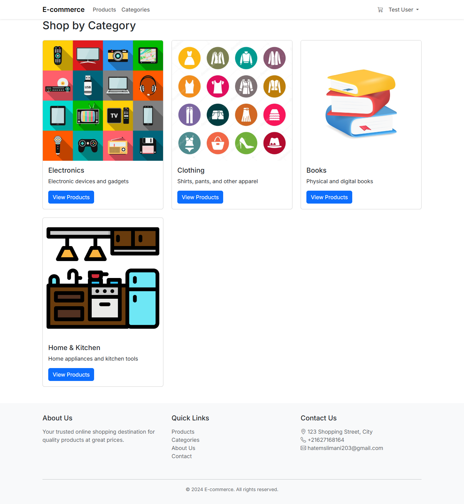
*Catalogue de produits*

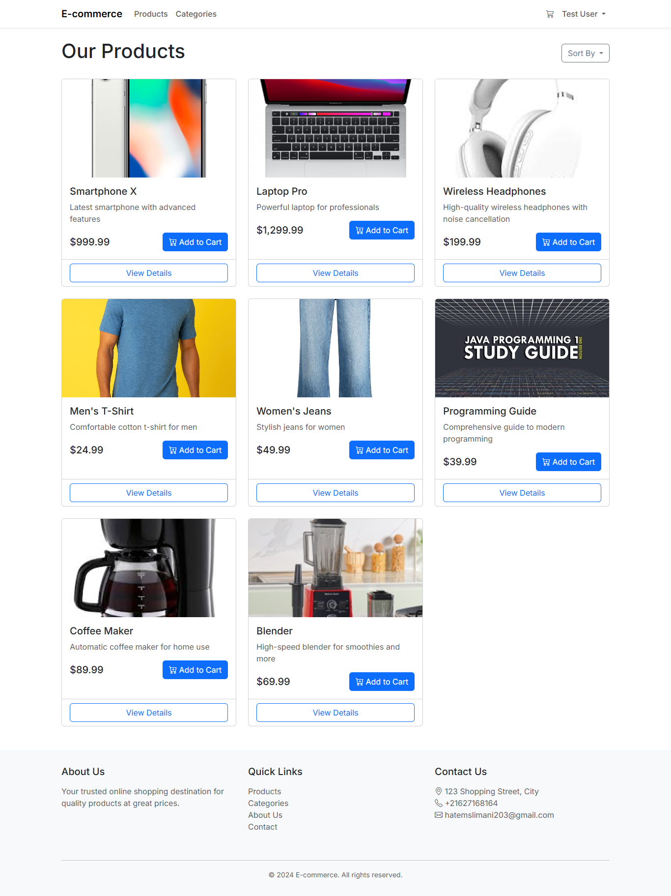
*Catalogue de produits avec filtres et recherche*

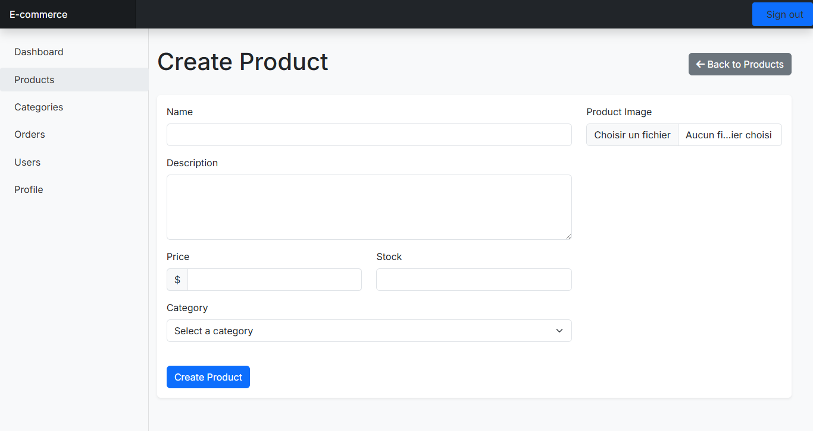
*ajouter un produit*

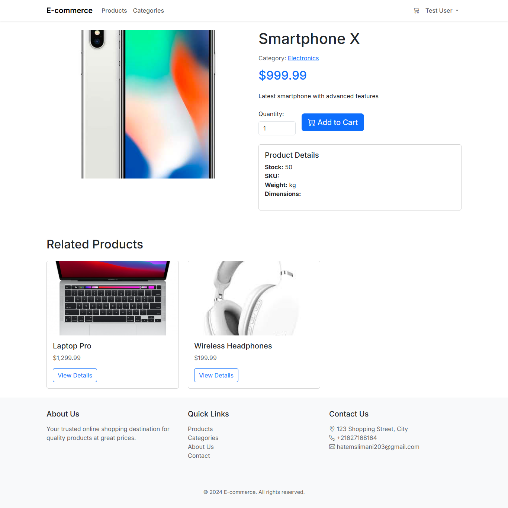
*Page détaillée d'un produit avec description et avis*

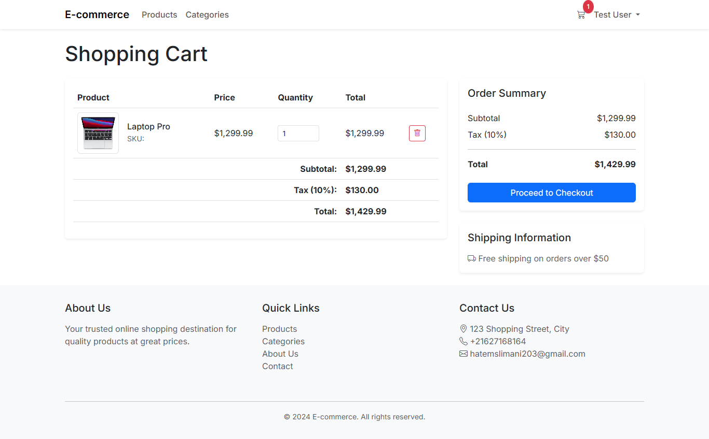
*Panier d'achat*

### Interface d'authentification

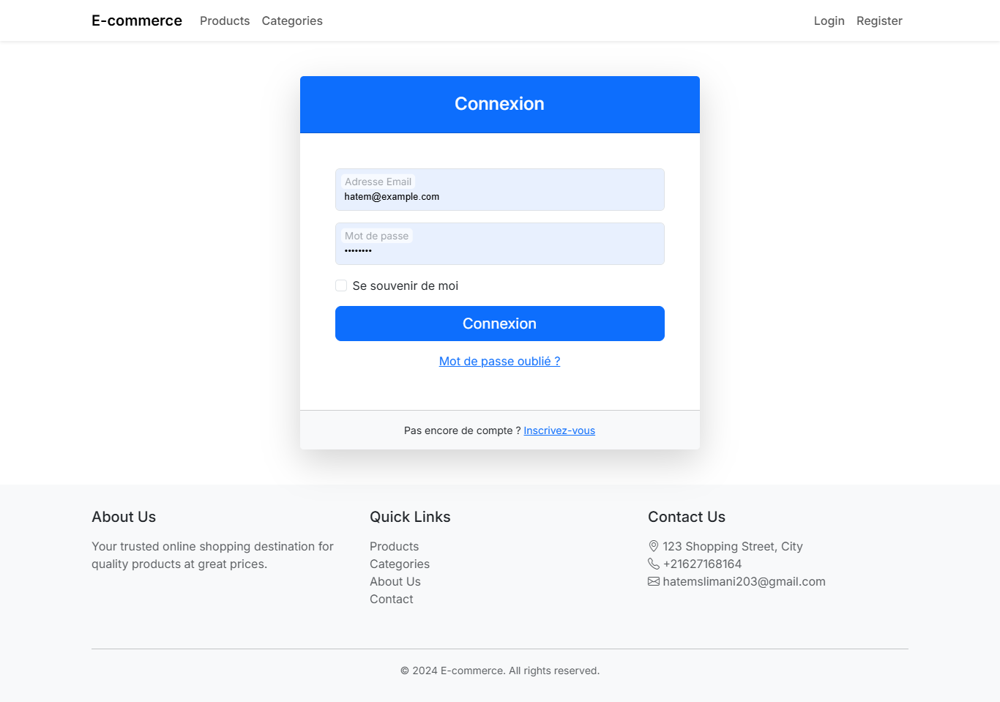
*Page de connexion avec design moderne*


*Formulaire d'inscription intuitif*

### Interface Administrateur

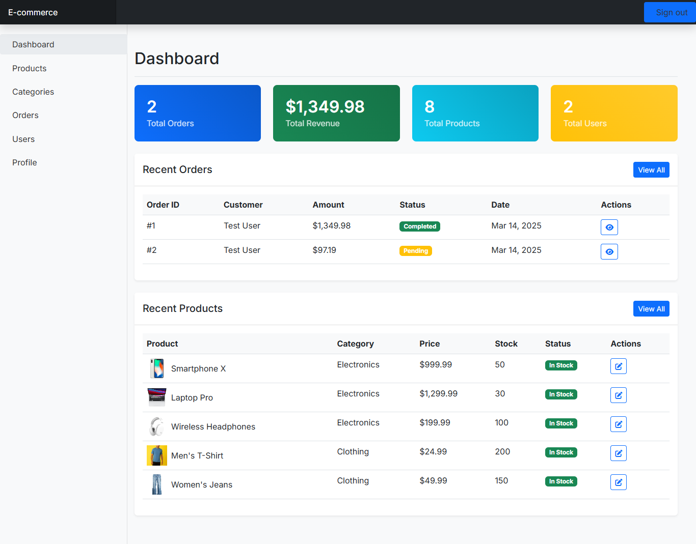
*Tableau de bord administrateur avec statistiques*

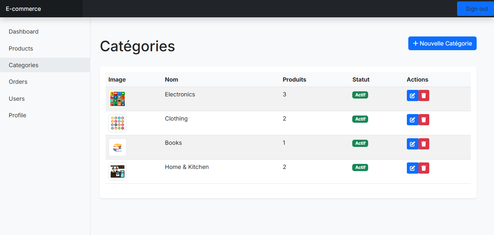
*Interface de gestion des catégories*

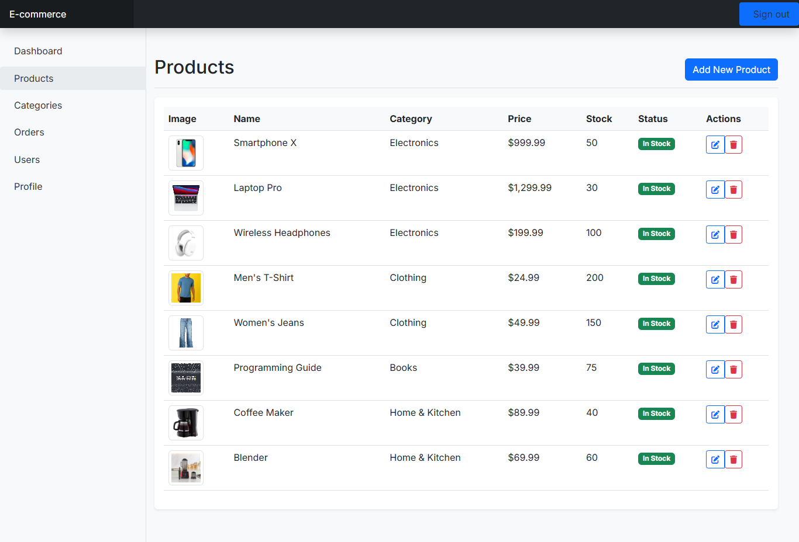
*Liste des produits avec options de gestion*

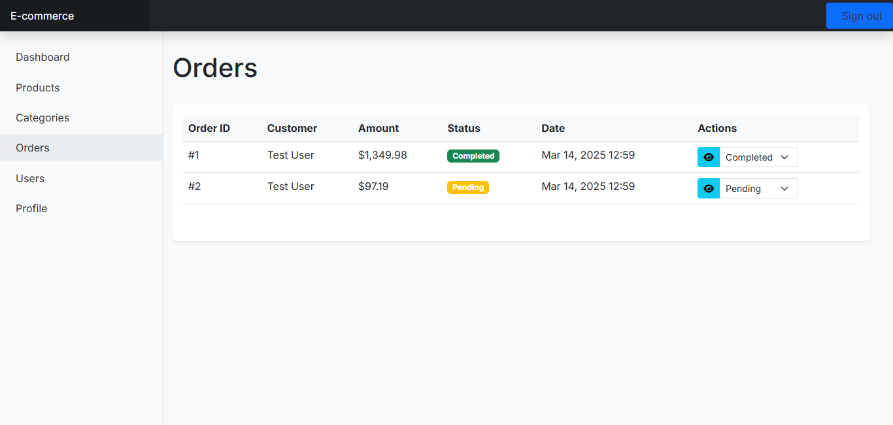
*Suivi et gestion des commandes*


*Administration des comptes utilisateurs*

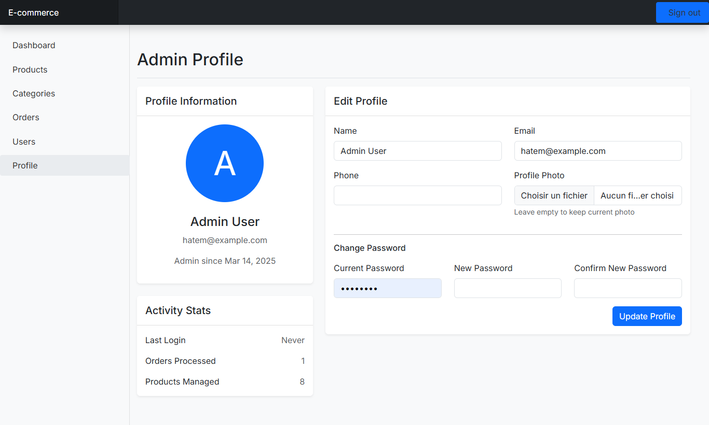
*Gestion du profil administrateur*


### Processus de commande


*Panier d'achat*

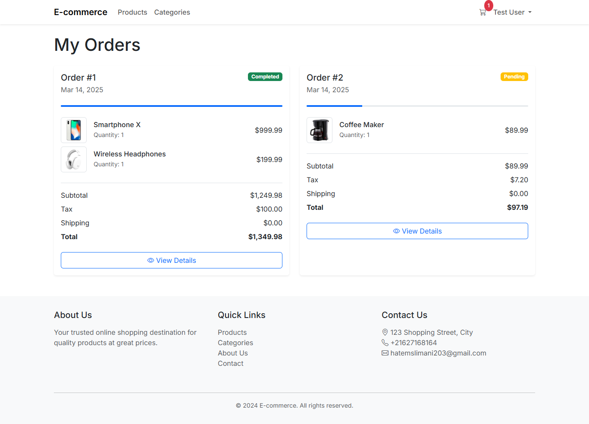
*Interface de suivi de commande*

## ✨ Fonctionnalités

### Pour les Clients
- 🛍️ Parcourir les produits par catégories
- 🔍 Rechercher et filtrer les produits
- 🛒 Gestion du panier d'achat
- 📦 Suivi des commandes
- 👤 Gestion du profil utilisateur
- 📍 Adresses de livraison multiples
- 🔐 Authentification sécurisée

### Pour les Administrateurs
- 📊 Tableau de bord avec analyses des ventes
- 📝 Gestion des produits
- 🗂️ Gestion des catégories
- 📦 Traitement des commandes
- 👥 Gestion des utilisateurs
- 🔧 Paramètres système

## 🚀 Stack Technique

- **Framework :** Laravel
- **Base de données :** MySQL
- **Frontend :** Templates Blade, Bootstrap
- **Authentification :** Laravel Breeze
- **Stockage de fichiers :** Laravel Storage

## 📋 Prérequis

- PHP
- Composer
- MySQL
- Node.js & NPM
- Laravel CLI

## 💻 Installation

1. Cloner le dépôt :
```bash
git clone https://github.com/yourusername/ecommerce.git
cd ecommerce
```

2. Installer les dépendances PHP :
```bash
composer install
```

3. Créer et configurer le fichier d'environnement :
```bash
cp .env.example .env
php artisan key:generate
```

4. Configurer la base de données dans `.env` :
```env
DB_CONNECTION=mysql
DB_HOST=127.0.0.1
DB_PORT=3306
DB_DATABASE=nom_de_votre_base
DB_USERNAME=votre_utilisateur
DB_PASSWORD=votre_mot_de_passe
```

5. Exécuter les migrations et les seeders :
```bash
php artisan migrate --seed
```

6. Démarrer le serveur de développement :
```bash
php artisan serve
```

## 📱 Utilisation

### Compte Client
1. Créer un nouveau compte
2. Parcourir les produits et les ajouter au panier
3. Gérer les adresses de livraison
4. Passer des commandes et suivre leur statut
5. Consulter l'historique des commandes
6. Mettre à jour le profil et le mot de passe

### Compte Administrateur
Fonctionnalités administrateur :
1. Gestion des produits
2. Gestion des catégories
3. Traitement des commandes
4. Gestion des utilisateurs
5. Analyses des ventes

